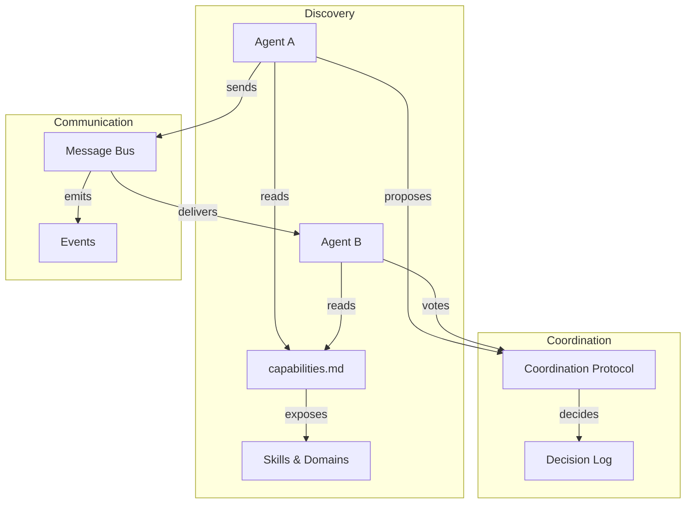

# Inter-Agent Connectivity

> [!abstract] How Agents Discover, Communicate, and Coordinate
> This section defines how agents in a multi-agent workflow discover each other's capabilities, exchange messages, coordinate work, and reach consensus. The base template is designed for **single-agent isolation** with optional interconnect -- agents work independently by default and opt into coordination when needed.

## Overview



## Design Principles

1. **Isolation by default.** Agents work independently in their own worktrees. Interconnect is opt-in, not mandatory.
2. **File-based coordination.** All inter-agent state is stored in files (JSONL, JSON, Markdown) -- no runtime services required.
3. **Eventual consistency.** Agents read shared state at their own pace. No real-time synchronization assumed.
4. **Protocol-agnostic.** The base template defines data formats and conventions. Orchestration harnesses (LoopDuck, OpenClaw, CLI scripts) implement the transport.
5. **Compatible with ecosystem.** Aligns with Google A2A (`AgentCard`), MCP (tool registry), and OpenClaw sessions (message routing).

## Components

### [[interconnect/capabilities|Capabilities]]

How agents declare what they can do -- skills, expertise domains, authority, and voting weight. Machine-readable format that enables:
- **Discovery:** "Who can help with this domain?"
- **Routing:** Assign tasks to agents with matching expertise
- **Authority:** Define who can approve or veto in specific domains

### [[interconnect/coordination|Coordination]]

How agents work together -- phases, messaging, consensus voting, decision logging, and escalation. Defines:
- **Message types:** Proposal, Concern, Agreement, Decision
- **Consensus protocol:** Approve / ApproveWithConditions / RequestChanges
- **Phase model:** Planning, Execution, Review, Retrospective
- **Escalation:** Retry limits, human escalation triggers

### [[interconnect/self-improvement|Self-Improvement]]

How agents learn from experience -- session metrics, skill progression, retrospective-to-memory pipeline, and pattern detection. Enables:
- **Metrics tracking:** Task completion rate, gate pass rate, revision cycles
- **Skill progression:** Proficiency levels evolve based on task outcomes
- **Pattern detection:** Recurring blockers and feedback themes auto-generate memories
- **Enhanced wake-up:** Session start includes learned practices, not just stored facts

### Task Log Extensions

Inter-agent fields added to the `TaskLogEntry` schema (see [[conventions|Conventions]]):
- `waitingFor` -- async dependency on another agent
- `handoffFrom` -- provenance tracking
- `reviewStatus` -- review state machine
- `blockerType` -- structured blocker categories

### Event Types

Standardized notifications for inter-agent coordination (see [[conventions|Conventions]]):
- Task lifecycle: `task.completed`, `task.blocked`, `task.handed_off`
- Review: `review.requested`, `review.completed`, `review.changes_requested`
- Wave: `wave.started`, `wave.completed`
- Consensus: `consensus.proposed`, `consensus.reached`, `consensus.escalated`

## Integration with Ecosystem

| Ecosystem Component | Interconnect Alignment |
|---------------------|----------------------|
| **Google A2A** (`AgentCard`) | `capabilities.md` maps to `AgentCard.skills[]` and `AgentCard.capabilities` |
| **LoopDuck Internal MCP** | Event types align with LoopDuck's pub/sub bus (`ResourceChanged`) |
| **LoopDuck Council** | Coordination protocol mirrors council phases, voting, and escalation |
| **OpenClaw sessions-send** | Message types align with session-based agent-to-agent messaging |
| **OpenClaw sub-agents** | Handoff protocol aligns with sub-agent spawn/announce chains |
| `.agents/assignments.json` | Wave coordination extends existing wave/dependency tracking |

## File Structure

```
interconnect/
  README.md              # this file -- overview
  capabilities.md        # skill/expertise declaration format
  coordination.md        # phases, messaging, consensus, decisions
```

## How to Use

### For Single-Agent Work (default)

No changes needed. The base template works as before. Interconnect files are reference documentation that agents can consult when multi-agent coordination is needed.

### For Multi-Agent Waves

1. Each agent declares capabilities in its profile (see [[interconnect/capabilities|Capabilities]])
2. Orchestrator reads capabilities to assign tasks by expertise
3. Agents use structured blocker types and review status in task-log
4. Events signal completion, enabling wave transitions

### For Agent Council (LoopDuck-style)

1. Agents declare expertise domains and voting weight
2. Council orchestrator reads capabilities for role assignment
3. Coordination protocol defines deliberation rounds
4. Consensus voting determines collective decisions

## See Also

- [[interconnect/capabilities|Capabilities]] -- skill and expertise declaration
- [[interconnect/coordination|Coordination]] -- phases, messaging, consensus
- [[interconnect/self-improvement|Self-Improvement]] -- learning loop and metrics
- [[README|Base Profile]] -- agent template
- [[conventions|Conventions]] -- task-log extensions and event types
- [[projects/branching|Branching]] -- worktree isolation (the foundation)
- [[neutrality|Neutrality]] -- backend-neutral design
