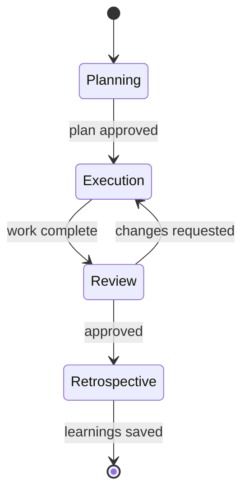
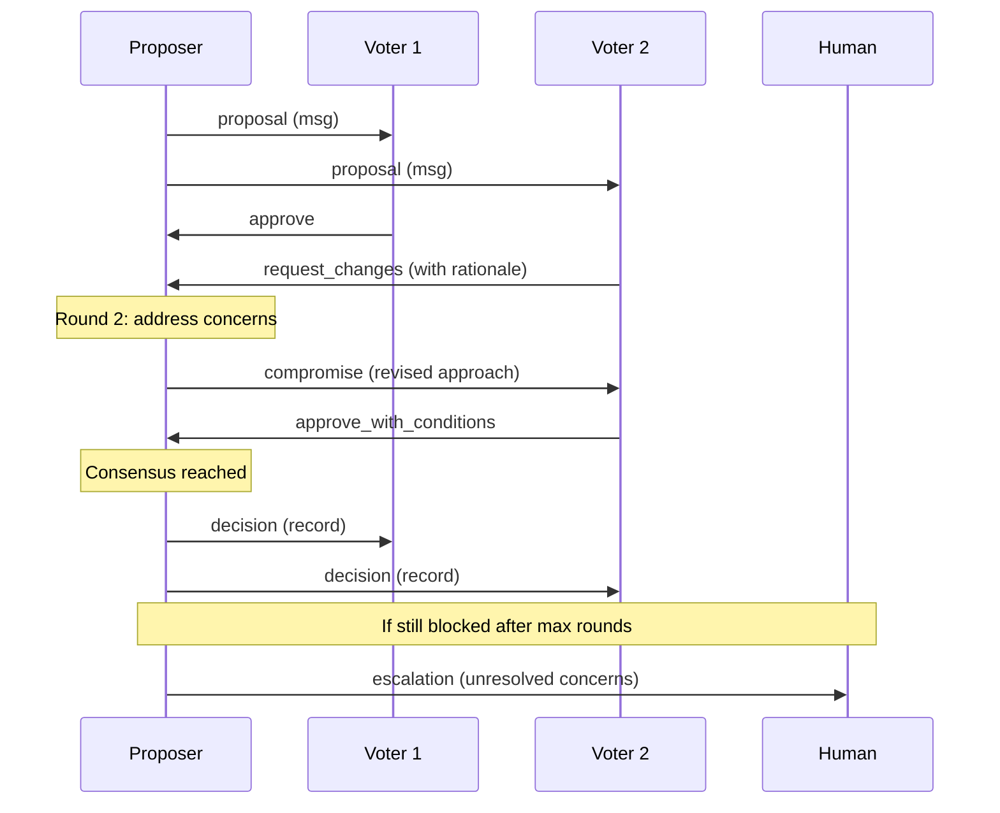

# Multi-Agent Coordination Protocol

> [!abstract] Phases, Messaging, Consensus, and Decision Logging
> When multiple agents collaborate on a task, they need structured ways to communicate, deliberate, vote, and record decisions. This protocol defines the coordination patterns -- from simple handoffs to full council-style consensus.

## Coordination Levels

Not every multi-agent workflow needs full consensus. Choose the right level:

| Level | Name | When to Use | Mechanism |
|-------|------|-------------|-----------|
| **L0** | Independent | Agents work in parallel on separate tasks | Worktree isolation only |
| **L1** | Handoff | Agent A completes, Agent B continues | Task log `handoffFrom` field |
| **L2** | Review | Agent A works, Agent B reviews | Review request + approval |
| **L3** | Deliberation | Multiple agents discuss before acting | Structured messaging + voting |
| **L4** | Consensus | Unanimous agreement required | Full council protocol |

## Phase Model

Multi-agent workflows progress through phases. Each phase has entry criteria, activities, and exit criteria.



### Phase Definitions

| Phase | Purpose | Entry Criteria | Exit Criteria |
|-------|---------|---------------|---------------|
| **Planning** | Decompose work, assign tasks, agree on approach | Task/epic defined | Task assignments agreed, branches created |
| **Execution** | Implement, test, verify | Assignments clear, worktrees created | All tasks pass verification gates |
| **Review** | Cross-agent code review, architecture check | Execution complete, branches pushed | All reviews approved or escalated |
| **Retrospective** | Capture learnings, update memory | Review complete | Discoveries saved to memory |

### Phase Transitions

Phase transitions are signaled via events (see Event Types in [[conventions|Conventions]]):

```json
{
  "event": "phase.transition",
  "from": "execution",
  "to": "review",
  "triggeredBy": "agent-oracle-coding",
  "timestamp": "2026-04-16T14:00:00Z",
  "context": {
    "tasksCompleted": 3,
    "tasksFailed": 0
  }
}
```

## Message Types

Agents communicate using structured message types. Each message has a type, sender, content, and optional references.

### Message Format

```json
{
  "messageId": "msg-001",
  "type": "proposal",
  "from": "agent-oracle-coding",
  "to": "all",
  "timestamp": "2026-04-16T10:00:00Z",
  "subject": "API design for user authentication",
  "content": "I propose we use JWT with refresh tokens...",
  "references": ["task-PROJ-42", "msg-000"],
  "requiresResponse": true
}
```

### Type Catalog

| Type | Purpose | Requires Response | Example |
|------|---------|-------------------|---------|
| `proposal` | Suggest an approach or design | Yes | "I propose we split this into 3 modules" |
| `concern` | Raise an issue or risk | Yes | "This approach may break the plugin boundary" |
| `question` | Ask for information or clarification | Yes | "Does the auth module handle token refresh?" |
| `agreement` | Endorse a proposal or resolution | No | "Agreed, the 3-module approach is clean" |
| `objection` | Formally block a proposal (requires rationale) | Yes | "This violates the API contract -- here's why" |
| `compromise` | Suggest a modified approach after disagreement | Yes | "What if we keep 2 modules but extract the shared logic?" |
| `decision` | Record a collective decision | No | "Decided: 3-module split, JWT with refresh tokens" |
| `handoff` | Transfer responsibility for a task | No | "Handing off PROJ-42 to agent-qa for review" |
| `status` | Report progress or blockers | No | "PROJ-42: 70% complete, blocked on schema migration" |

### Message Log

Messages are appended to a shared log file:

```
agents/_shared/messages.jsonl
```

One JSON object per line. Agents read the log to catch up on discussions they missed.

> [!tip] Message Log Location
> For multi-agent waves using `.agents/`, the message log lives at `.agents/messages.jsonl`. For agent-local work, agents use their own `task-log.jsonl`. The orchestration harness determines which log to use.

## Consensus Protocol

When agents must agree before proceeding (L3-L4 coordination).

### Vote Types

```yaml
ConsensusVote:
  enum:
    - approve                  # Fully endorse
    - approve_with_conditions  # Endorse if conditions met
    - request_changes          # Block until specific changes made
    - abstain                  # No opinion (doesn't count toward quorum)
```

### Vote Format

```json
{
  "voteId": "vote-001",
  "proposalRef": "msg-001",
  "voter": "agent-oracle-coding",
  "vote": "approve_with_conditions",
  "conditions": ["Add rate limiting to the auth endpoint"],
  "rationale": "JWT approach is sound but needs rate limiting to prevent brute force",
  "timestamp": "2026-04-16T10:30:00Z"
}
```

### Consensus Rules

| Rule | L3 (Deliberation) | L4 (Consensus) |
|------|-------------------|----------------|
| **Quorum** | Majority of assigned agents | All assigned agents |
| **Approval threshold** | Simple majority | Unanimous (approve or approve_with_conditions) |
| **Veto power** | No formal veto | Agents with `vetoDomains` can block |
| **Max rounds** | 2 | 3 |
| **Timeout** | Skip to majority after timeout | Escalate to human after timeout |
| **Abstain** | Doesn't count toward quorum | Doesn't count toward quorum |

### Consensus Flow



## Blocker Types

Structured categories for blockers in `task-log.jsonl`:

```yaml
BlockerType:
  enum:
    - missing_info      # Need clarification or documentation
    - architecture      # Design conflict or boundary violation
    - security          # Security risk identified
    - performance       # Performance concern
    - dependency        # Waiting on external dependency or another task
    - review            # Waiting for review from another agent
    - consensus         # Waiting for collective decision
    - tooling           # Tool/environment issue
    - unknown           # Unclassified (requires triage)
```

### Blocker Format (in task-log.jsonl)

```json
{
  "taskId": "PROJ-42",
  "status": "blocked",
  "blockerType": "review",
  "blockers": [
    {
      "type": "review",
      "raisedBy": "agent-oracle-coding",
      "assignedTo": "agent-qa",
      "description": "Architecture review needed before implementing API changes",
      "raisedAt": "2026-04-16T11:00:00Z",
      "resolvedAt": null,
      "resolution": null
    }
  ]
}
```

## Handoff Protocol

When Agent A transfers work to Agent B.

### Handoff Document

```json
{
  "handoffId": "ho-001",
  "from": "agent-oracle-coding",
  "to": "agent-qa",
  "taskId": "PROJ-42",
  "timestamp": "2026-04-16T12:00:00Z",
  "context": {
    "whatWasDone": "Implemented JWT auth with refresh tokens",
    "branchName": "feature/proj-42",
    "filesChanged": ["src/auth/jwt.ts", "src/auth/refresh.ts"],
    "testsWritten": ["src/auth/jwt.test.ts"],
    "verificationGate": "passed",
    "openQuestions": ["Should refresh tokens expire after 30 or 90 days?"],
    "knownIssues": []
  },
  "expectedOutput": "Review code for security issues, add integration tests"
}
```

### Handoff Rules

1. **Include context.** The receiving agent shouldn't need to re-discover what was done.
2. **Specify expected output.** What should the receiving agent deliver?
3. **List open questions.** Don't hide uncertainty -- surface it.
4. **Update task-log.** Set `handoffFrom` and `waitingFor` fields.
5. **Signal via event.** Emit `task.handed_off` event.

## Decision Log (ADR)

Architecture Decision Records capture collective decisions for future reference.

### ADR Format

```markdown
# ADR-001: JWT with Refresh Tokens for Authentication

**Status:** Accepted
**Date:** 2026-04-16
**Participants:** agent-oracle-coding, agent-qa, agent-security

## Context

We need to implement user authentication for the API. Options considered:
1. Session-based auth with cookies
2. JWT with refresh tokens
3. OAuth2 with external provider

## Decision

JWT with refresh tokens (option 2).

## Rationale

- Stateless -- scales horizontally without shared session store
- Refresh tokens provide security (short-lived access tokens)
- Compatible with mobile clients (no cookie dependency)

## Concerns Raised

- **agent-security:** Rate limiting needed on refresh endpoint (addressed: added rate limiter)
- **agent-qa:** Token expiry edge cases need E2E tests (addressed: added test suite)

## Consequences

- Must implement token rotation on refresh
- Must handle clock skew between services
- Refresh token storage must be secure (HttpOnly cookie or secure storage)
```

### ADR Storage

```
agents/_shared/decisions/
  adr-001-jwt-auth.md
  adr-002-module-split.md
```

Or within a specific project's docs if scoped.

## Escalation Rules

When agents cannot reach consensus:

| Round | Action |
|-------|--------|
| **Round 1** | Initial vote. If consensus, proceed. If not, identify concerns. |
| **Round 2** | Proposer addresses concerns with revised approach. Re-vote. |
| **Round 3** (L4 only) | Final attempt. Compromises proposed by any agent. |
| **Escalation** | If still blocked: pause work, document unresolved concerns, notify human. |

### Escalation Document

```json
{
  "escalationId": "esc-001",
  "proposalRef": "msg-001",
  "status": "escalated",
  "roundsCompleted": 3,
  "unresolved": [
    {
      "concern": "Plugin boundary violation",
      "raisedBy": "agent-oracle-coding",
      "attempts": ["compromise-001", "compromise-002"],
      "blockedBy": "agent-qa"
    }
  ],
  "humanAction": "pending",
  "timestamp": "2026-04-16T15:00:00Z"
}
```

## Retrospective-to-Memory Pipeline

After the retrospective phase, route items to the appropriate memory type automatically. See [[interconnect/self-improvement|Self-Improvement Loop]] for the full learning pipeline.

### Routing Rules

| Retro Category | Memory Type | Auto-Generated Fields |
|---------------|-------------|----------------------|
| `to_improve` | **feedback** | Rule from item text, **Why** from session context, **How to apply** from tags |
| `went_well` | **reference** | Pattern description, when to reuse (from domain/tags) |
| `action_items` | **project** | Action, owner, absolute deadline, follow-up sprint |

### Pipeline Steps

1. **Collect:** Retrospective phase produces `RetroItem[]` (see [[conventions|Conventions]])
2. **Route:** Each item maps to a memory type based on its category
3. **Generate:** Create memory file with YAML frontmatter + structured body
4. **Index:** Add one-line entry to MEMORY.md
5. **Follow up:** Action items with deadlines surface in next session's wake-up

### `to_improve` → Feedback Memory

```markdown
---
name: {{generated from item text}}
description: {{one-line summary}}
type: feedback
created: {{today}}
---

{{Rule derived from the improvement item}}

**Why:** Session {{sessionId}}: {{original item text with context}}
**How to apply:** {{derived from tags -- e.g., "When working on [domain] tasks, [specific guidance]"}}
```

### `went_well` → Reference Memory

```markdown
---
name: {{pattern name}}
description: {{one-line summary of what worked}}
type: reference
created: {{today}}
---

{{Description of the pattern that worked well}}

**When to reuse:** {{derived from tags and domain context}}
```

### `action_items` → Project Memory

```markdown
---
name: {{action item title}}
description: {{one-line action description}}
type: project
created: {{today}}
---

{{Action item description}}

**Why:** Identified during retrospective on {{date}}. {{context from session}}.
**How to apply:** Must be completed by {{targetDate}}. Owner: {{actionOwner}}. Follow up in next retrospective.
```

### Action Item Follow-Up Protocol

At each session start:

1. Read project memories with "action item" in description
2. Check if `targetDate` has passed
3. If overdue: surface immediately with high priority
4. If completed: update memory with resolution, or remove if no longer relevant
5. If still in progress: note in session context for awareness

## See Also

- [[interconnect/self-improvement|Self-Improvement]] -- full learning loop
- [[interconnect/capabilities|Capabilities]] -- skill and expertise declaration
- [[interconnect/README|Interconnect Overview]] -- how agents connect
- [[conventions|Conventions]] -- task-log extensions, event types, type definitions
- [[projects/branching|Branching]] -- worktree isolation
- [[trust-model|Trust Model]] -- security boundaries for agent interaction
