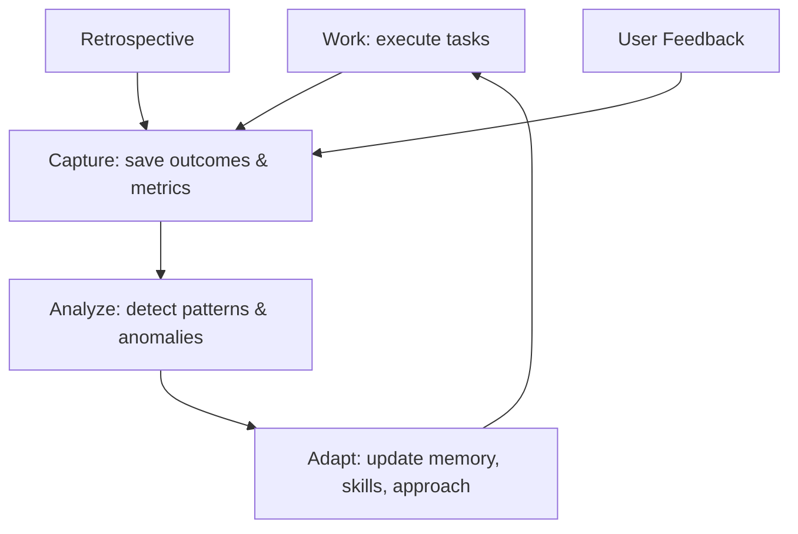
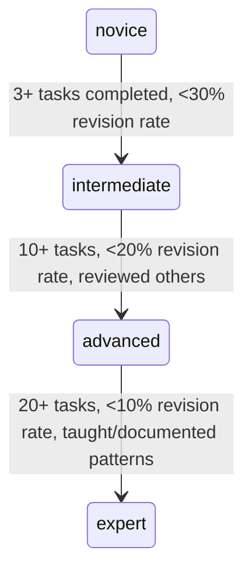
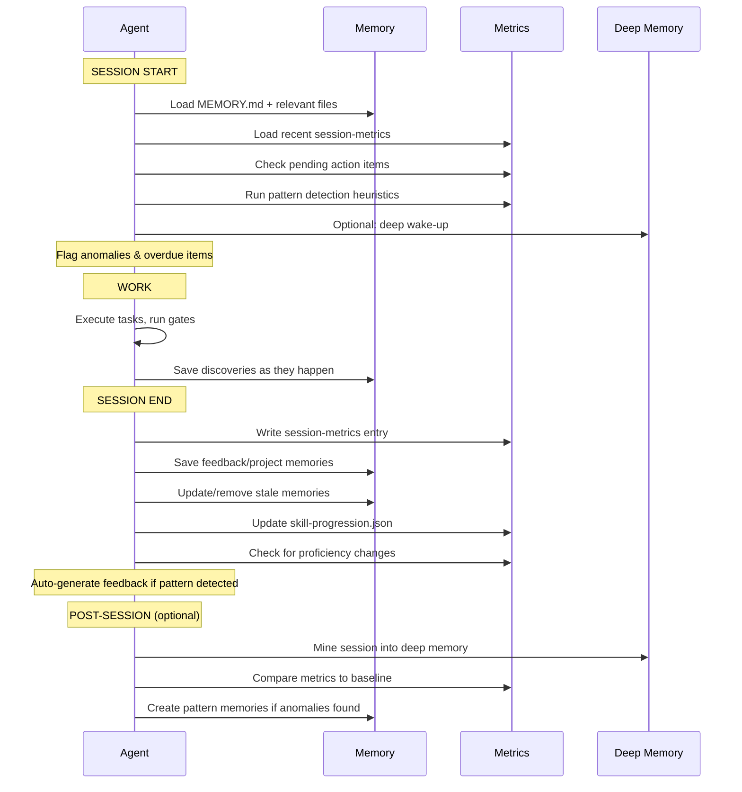

# Self-Improvement Loop

> [!abstract] How Agents Learn from Experience
> The self-improvement loop turns accumulated session data -- task outcomes, feedback, retrospective items, and blocker patterns -- into behavioral improvements. Agents don't just persist knowledge; they analyze it, detect patterns, and evolve their approach across sessions.

## The Loop



### Four Stages

| Stage | What Happens | When | Output |
|-------|-------------|------|--------|
| **Work** | Execute tasks, run verification gates | During session | Task outcomes, gate results |
| **Capture** | Record metrics, save feedback, log retro items | Session end | `session-metrics.jsonl`, memory files |
| **Analyze** | Detect patterns, compare against baselines, flag anomalies | Post-session (or periodic) | Pattern reports, anomaly alerts |
| **Adapt** | Update proficiency levels, refine approach, create action items | Next session start | Updated capabilities, new feedback memories |

## Session Metrics

Every session produces quantifiable outcomes. Agents track these in `session-metrics.jsonl` (one JSON object per session).

### What to Capture

```json
{
  "sessionId": "sess-2026-04-16-001",
  "agentId": "agent-oracle-coding",
  "startedAt": "2026-04-16T10:00:00Z",
  "endedAt": "2026-04-16T12:30:00Z",
  "metrics": {
    "tasksAttempted": 3,
    "tasksCompleted": 2,
    "tasksFailed": 1,
    "gatesPassed": 4,
    "gatesFailed": 1,
    "revisionCycles": 2,
    "blockersRaised": 1,
    "blockersResolved": 1,
    "memoriesCreated": 3,
    "memoriesUpdated": 1,
    "memoriesRemoved": 0,
    "handoffsInitiated": 0,
    "handoffsReceived": 1,
    "reviewsRequested": 1,
    "reviewsCompleted": 0
  },
  "blockerBreakdown": {
    "architecture": 0,
    "security": 1,
    "dependency": 0,
    "review": 0,
    "tooling": 0
  },
  "skillsUsed": ["typescript-development", "architecture-review"],
  "domainsActive": ["backend", "api-design"],
  "discoveries": ["JWT refresh token rotation requires atomic DB operation"]
}
```

### Where to Store

```
agents/agent-{name}/metrics/
  session-metrics.jsonl    # one line per session
```

### Baseline Comparison

After 5+ sessions, agents can compute rolling baselines:

| Metric | Baseline | Current | Signal |
|--------|----------|---------|--------|
| Task completion rate | 85% | 60% | Below baseline -- investigate |
| Gate pass rate | 92% | 95% | Above baseline -- approach is working |
| Revision cycles / task | 1.2 | 3.0 | High churn -- may need better planning |
| Blockers / session | 0.5 | 2.0 | More obstacles than usual -- flag for retro |

> [!tip] When to Flag Anomalies
> Flag when a metric deviates by more than 1.5x from the rolling 5-session average. This isn't a hard rule -- agents should use judgment about whether the deviation reflects a genuine problem or unusual task complexity.

## Skill Progression

Agent proficiency levels evolve based on task outcomes -- not just declarations.

### Progression Model



### Tracking

```json
{
  "skillId": "typescript-development",
  "proficiency": "advanced",
  "tasksCompleted": 14,
  "tasksFailed": 2,
  "successRate": 0.875,
  "avgRevisionCycles": 1.1,
  "lastUsed": "2026-04-16",
  "lastProgression": "2026-03-20",
  "progressionHistory": [
    {"from": "intermediate", "to": "advanced", "date": "2026-03-20", "evidence": "10+ tasks completed, 90% success, reviewed 3 PRs"}
  ]
}
```

### Progression Rules

| Current | Next | Criteria |
|---------|------|----------|
| `novice` | `intermediate` | 3+ tasks completed in this skill, revision rate < 30% |
| `intermediate` | `advanced` | 10+ tasks, revision rate < 20%, has reviewed others' work |
| `advanced` | `expert` | 20+ tasks, revision rate < 10%, has documented patterns or taught |

> [!warning] Regression
> Proficiency can also regress. If an agent's success rate drops below 60% over 5 consecutive tasks in a skill, consider downgrading proficiency. This prevents stale expertise claims.

### Where to Store

```
agents/agent-{name}/metrics/
  skill-progression.json   # current state of all skills
```

Update `capabilities.json` proficiency levels when progression occurs.

## Retrospective-to-Memory Pipeline

Retrospective items are **automatically routed** to the appropriate memory type.

### Routing Rules

| Retro Category | Memory Type | Format |
|---------------|-------------|--------|
| `to_improve` | **feedback** | Rule + Why (from session context) + How to apply |
| `went_well` | **reference** | Pattern description + When to reuse |
| `action_items` | **project** | Action + Owner + Deadline + Follow-up sprint |

### Example Pipeline

**Input** (from retrospective):
```json
{
  "category": "to_improve",
  "item": "Spent 30 minutes debugging a type error that strict mode would have caught immediately",
  "tags": ["process", "tooling"]
}
```

**Output** (feedback memory auto-created):
```markdown
---
name: Run strict type check before debugging
description: Always run type checker first when encountering runtime errors
type: feedback
created: 2026-04-16
---

Run strict type check (`{{verifyCmd}}`) before manual debugging when encountering runtime type errors.

**Why:** Session 2026-04-16: spent 30 minutes debugging a type error manually that strict mode would have caught in seconds.
**How to apply:** When a runtime error looks type-related, run the type checker first. Don't start debugging until the type checker passes.
```

### Action Item Follow-Up

Action items become project memories with absolute deadlines:

```markdown
---
name: Add rate limiting to auth endpoint
description: Security action item from Sprint 3 retrospective
type: project
created: 2026-04-16
---

Add rate limiting to the JWT refresh endpoint to prevent brute force attacks.

**Why:** Identified during Sprint 3 retrospective. Agent-security raised concern during consensus voting on auth design.
**How to apply:** Must be completed before Sprint 4 ends (2026-04-30). Owner: agent-oracle-coding. Follow up in Sprint 4 retrospective.
```

At the start of the next session/sprint, check pending action items:
1. Read project memories tagged as action items
2. Check if deadline has passed
3. Mark as DONE (remove memory) or OVERDUE (flag in retro)

## Pattern Detection

Agents identify recurring patterns across sessions to surface systemic improvements.

### What to Detect

| Pattern | Signal | Action |
|---------|--------|--------|
| **Repeated blocker type** | Same `blockerType` in 3+ consecutive sessions | Create feedback memory about root cause |
| **Consistent gate failures** | Same verification gate fails across sessions | Investigate systemic quality issue |
| **High revision cycles** | > 2x baseline for a specific skill/domain | Consider skill regression or area complexity |
| **Frequent handoffs** | Same agent pair hands off repeatedly | Consider merging responsibilities or improving handoff docs |
| **Recurring feedback** | Similar user corrections across sessions | Strengthen the feedback memory, consider persona update |

### Detection Heuristics

At session start (after wake-up), scan recent metrics:

```
1. Load last 5 session-metrics entries
2. For each blocker type: count occurrences
   - If any type appears 3+ times → create feedback memory
3. Compare current gate pass rate to rolling average
   - If below 70% → flag for investigation
4. Check pending action items from previous retros
   - If any are overdue → surface immediately
5. Scan feedback memories for clustering
   - If 3+ feedback memories share the same "How to apply" domain → consolidate
```

### Pattern Memory Format

When a pattern is detected, create a feedback memory:

```markdown
---
name: Recurring security blockers in API tasks
description: Security review blockers appear in 3 of last 5 sessions involving API work
type: feedback
created: 2026-04-16
---

Security review consistently blocks API tasks. Request security review earlier in the process -- during planning, not after implementation.

**Why:** Sessions 2026-04-10, 2026-04-12, 2026-04-16 all had security blockers on API work. Average delay: 4 hours per blocker.
**How to apply:** When planning API-related tasks, include a security review checkpoint before implementation begins. Use the review.requested event early.
```

## Enhanced Wake-Up

The session start wake-up context is enriched with learned practices.

### Standard Wake-Up (Tier 1)

Always loaded:
1. MEMORY.md index
2. Relevant memory files for the current task
3. Task-log for in-progress work

### Enhanced Wake-Up (Self-Improvement Additions)

After standard wake-up, also load:

```
4. Recent session metrics (last 3 sessions)
   → "Your recent task completion rate is 85%, up from 75% last sprint"

5. Pending action items from retrospectives
   → "Action item overdue: add rate limiting to auth endpoint (due 2026-04-14)"

6. Detected patterns and anomalies
   → "Pattern: security blockers recurring in API tasks -- consider early review"

7. Skill progression updates
   → "Primary skill proficiency progressed to advanced (2026-03-20)"

8. Top "went well" patterns from recent retros
   → "Pattern: breaking tasks into <50 LOC chunks reduced revision cycles by 40%"
```

### Deep Wake-Up (Tier 2)

If deep memory backend is configured:

```bash
# Standard deep wake-up
{{deepMemoryCmd}} wake-up

# Enhanced: include learned practices
{{deepMemoryCmd}} search "recurring patterns in recent sessions"
{{deepMemoryCmd}} search "action items pending from retrospective"
```

## Session Lifecycle (Extended)

The complete session lifecycle with self-improvement:



## File Structure

```
agents/agent-{name}/
  metrics/
    session-metrics.jsonl    # one line per session
    skill-progression.json   # current proficiency state
  memories/
    MEMORY.md               # index (includes learned practices)
    feedback_*.md           # includes retro-generated feedback
    project_*.md            # includes action items with deadlines
    reference_*.md          # includes "went well" patterns
```

## See Also

- [[interconnect/README|Interconnect Overview]] -- how agents connect
- [[interconnect/capabilities|Capabilities]] -- skill declaration and proficiency
- [[interconnect/coordination|Coordination]] -- retrospective phase and ADRs
- [[memories/README|Memories]] -- memory system overview
- [[memories/memory|Deep Memory]] -- Tier 2 backend and mining
- [[conventions|Conventions]] -- metrics type definitions
- [[mindsets/README|Mindsets]] -- thinking frameworks for self-reflection
