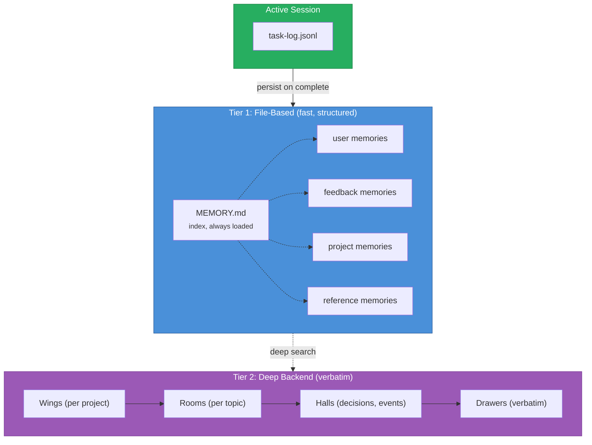

# Agent Memory System

> [!abstract] Cross-Session Persistent Memory
> The memory system ensures no conversation starts from zero. It persists decisions, discoveries, user preferences, and project state across session boundaries through a two-tier architecture.

## Architecture



## Memory Types

| Type | Purpose | When to Save | Structure |
|------|---------|-------------|-----------|
| **user** | Who you're working with | Role, prefs, expertise | Content body |
| **feedback** | How to approach work | Corrections + confirmations | Rule -> **Why** -> **How to apply** |
| **project** | What's happening | Goals, decisions, blockers | Fact -> **Why** -> **How to apply** |
| **reference** | Where to find things | External systems, URLs | Pointer + purpose |

## File Format

```markdown
---
name: {{descriptive name}}
description: {{one-line relevance hook}}
type: {{user | feedback | project | reference}}
created: {{ISO date}}
updated: {{ISO date}}
related:
  - "[[related note]]"
---

{{content body}}

**Why:** {{motivation or context}}
**How to apply:** {{when/where this matters}}
```

## Rules

1. **Verify before acting.** Memory is a past claim -- check current code first.
2. **Save from failure AND success.** Corrections and confirmations both matter.
3. **Convert relative dates.** "Thursday" -> absolute date.
4. **Don't duplicate code knowledge.** Derive patterns from code, not memory.
5. **Keep MEMORY.md under 200 lines.** One-line entries. Content in files.
6. **Current state wins.** Update or remove stale entries.

## What NOT to Save

| Skip | Use Instead |
|------|-------------|
| Code patterns, architecture | Read the files |
| Git history | `git log` / `git blame` |
| Debug fix recipes | Read the code/commit |
| AGENTS.md content | Reference directly |
| Ephemeral task state | Task log |

## Session Lifecycle

### Start
1. MEMORY.md auto-loaded
2. Read relevant memory files
3. Read task-log for in-progress work
4. Optionally: deep memory wake-up
5. Verify claims against current code

### End
1. Update task-log with final status
2. Save discoveries as project/feedback memories
3. Update or remove stale memories
4. Optionally: mine session into deep memory

## Deep Memory Backend (Tier 2, optional)

When configured, the deep memory backend provides long-term verbatim storage and semantic search:

```bash
{{deepMemoryCmd}} wake-up                               # session start context
{{deepMemoryCmd}} search "why did we choose X over Y"   # search decisions
{{deepMemoryCmd}} mine {{sessionsPath}} --mode convos # mine sessions
```

- **File memory** = working memory (always loaded, small)
- **Deep backend** = long-term memory (search on demand, large)
- **Promote** frequently needed findings to file memory
- **Demote** rarely used file memories to deep backend

Configure the specific backend (vector DB, knowledge graph, etc.) in the agent's own config.

## See Also

- [[README|Base Profile]] -- full agent template
- [[persona/README|Persona]] -- agent identity
