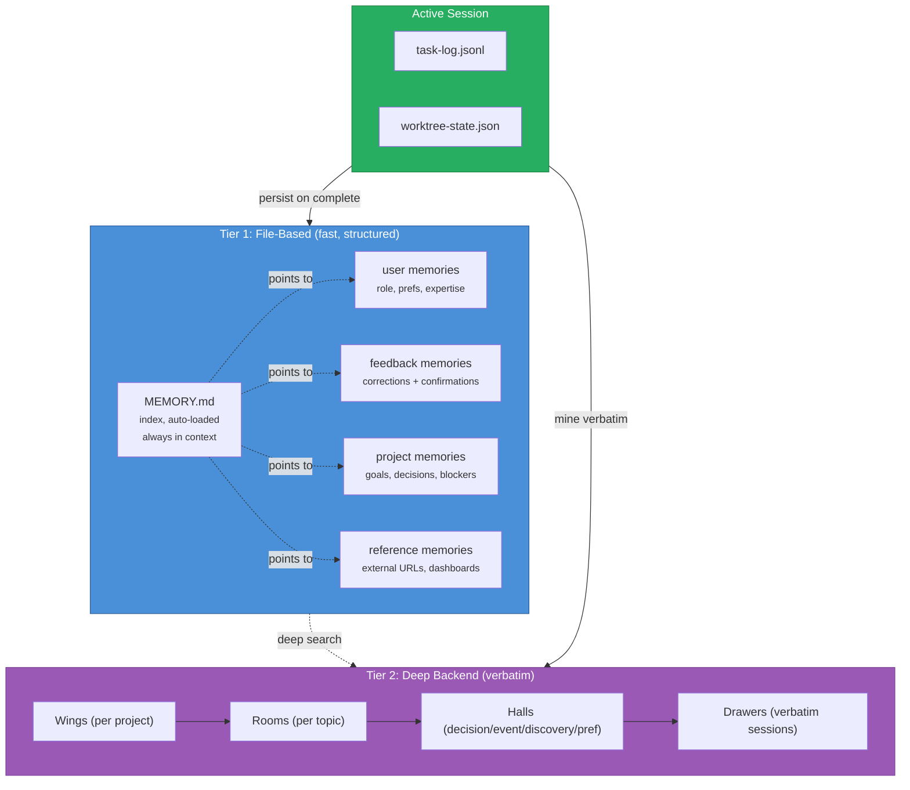
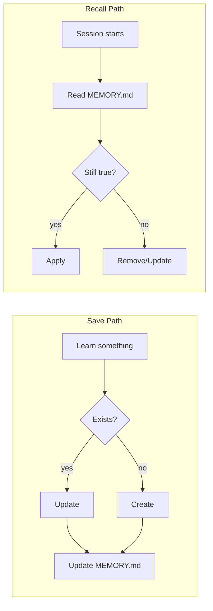
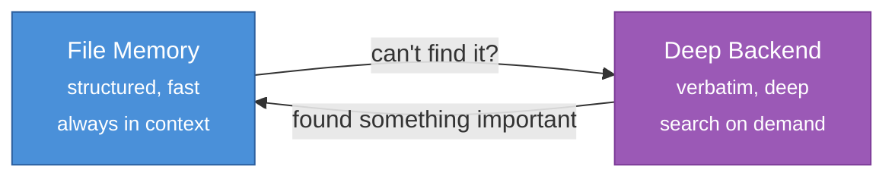
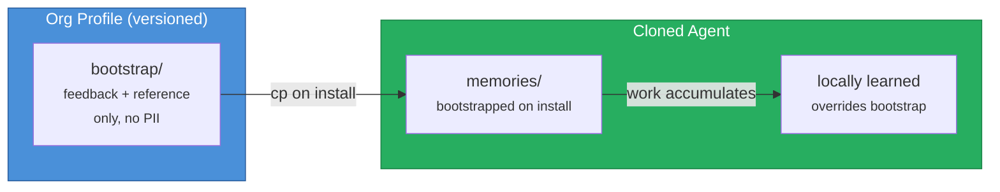
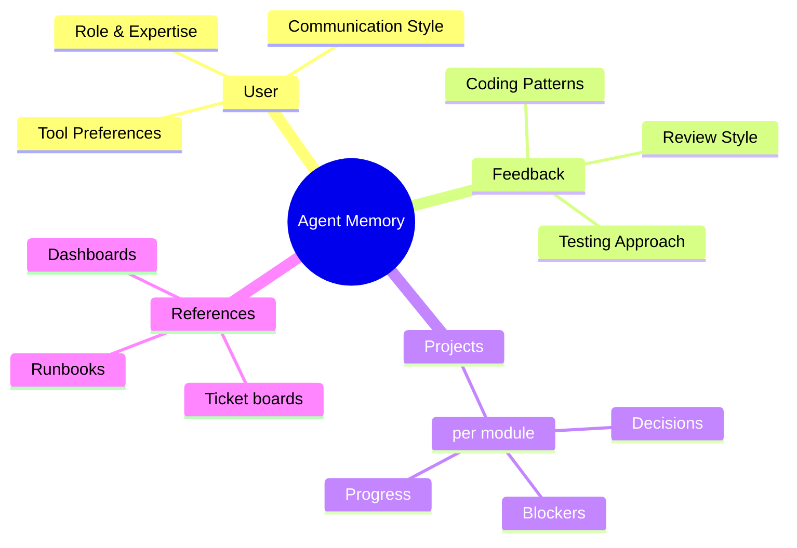

# Agent Memory System

> [!abstract] Cross-Session Persistent Memory
> The agent memory system ensures no conversation starts from zero. Decisions, discoveries, user preferences, and project state persist across session boundaries through a two-tier architecture: **file-based memory** for fast, structured recall and an optional **deep memory backend** for verbatim long-term storage and semantic search.

## Memory Architecture



## Tier 1: File-Based Memory

### Structure

```
{{memoryPath}}
  MEMORY.md              # index -- always loaded, max 200 lines
  user_role.md           # example: user is senior backend dev
  feedback_testing.md    # example: don't mock DB in integration tests
  project_freeze.md      # example: merge freeze 2026-04-20
  reference_tracker.md   # example: bugs tracked in Linear project X
```

### Memory File Format

```markdown
---
name: {{descriptive name}}
description: {{one-line relevance hook for future matching}}
type: {{user | feedback | project | reference}}
created: {{ISO date}}
updated: {{ISO date}}
related:
  - "[[related note or project]]"
---

{{content body -- the actual information}}

**Why:** {{motivation, context, or incident that produced this}}
**How to apply:** {{when and where this memory should influence behavior}}
```

### MEMORY.md Index Format

```markdown
- [Descriptive Title](filename.md) -- one-line hook (< 150 chars)
- [User Role](user_role.md) -- senior backend dev, new to frontend
- [No DB Mocks](feedback_testing.md) -- integration tests must hit real DB
```

### Memory Types in Detail

#### User Memories
**What:** Role, goals, responsibilities, expertise, preferences.
**When to save:** Any time you learn details about who the user is.
**How to use:** Tailor explanations, suggestions, and code style to the user's perspective.

> [!example]- Examples
> - "User is a data scientist investigating logging" -> explain in observability terms
> - "Deep backend expertise, first time touching frontend" -> frame frontend concepts via backend analogues
> - "Prefers terse responses, no trailing summaries" -> adjust communication style

#### Feedback Memories
**What:** Guidance on how to approach work -- corrections AND confirmations.
**When to save:** Any correction ("don't do X") or non-obvious confirmation ("yes, exactly like that").
**Structure:** Rule first, then **Why** (reason/incident) and **How to apply** (when it kicks in).

> [!example]- Examples
> - "Don't mock the database -- burned by prod migration mismatch last quarter"
> - "Single bundled PR was right call here -- splitting would be churn"
> - "Stop summarizing at end of response -- user reads the diff"

#### Project Memories
**What:** Ongoing work, goals, decisions, blockers, deadlines.
**When to save:** When you learn who/what/why/when. Convert relative dates to absolute.
**Structure:** Fact first, then **Why** (constraint/stakeholder) and **How to apply** (shape suggestions).

> [!example]- Examples
> - "Merge freeze begins 2026-04-20 for mobile release cut"
> - "Auth middleware rewrite driven by legal compliance, not tech debt"
> - "Wave 3 items: PROJ-31,32,37 -- depends on wave 2 completion"

#### Reference Memories
**What:** Pointers to external systems and resources.
**When to save:** When you learn about external tools, dashboards, or tracking systems.

> [!example]- Examples
> - "Pipeline bugs tracked in Linear project INGEST"
> - "grafana.internal/d/api-latency -- oncall latency dashboard"
> - "Release runbook at {repo}/blob/main/docs/release.md"

### Memory Lifecycle



### What NOT to Save

| Don't save | Why | Use instead |
|-----------|-----|-------------|
| Code patterns, architecture | Derivable from code | Read the files |
| Git history, who changed what | Authoritative in git | `git log`, `git blame` |
| Debugging fix recipes | Fix is in the code, context in commit msg | Read the code |
| AGENTS.md content | Already loaded | Reference directly |
| Ephemeral task details | Only useful this session | Use task-log instead |

---

## Tier 2: Deep Memory Backend (optional, pluggable)

Tier 2 is a **deep memory backend** for long-term verbatim storage and semantic search. The base profile is backend-agnostic -- each agent specifies which tool to use in its own config.

### Recommended Structure

Organize deep memory by project/module namespaces and topic categories:

| Concept | Maps To |
|---------|---------|
| **Namespaces / Wings** | One per project or module |
| **Topics / Rooms** | Per feature area within a namespace |

### Memory Categories

| Category | Content | Example |
|----------|---------|---------|
| **Facts** | Decisions locked in | "Chose framework X for desktop apps" |
| **Events** | Sessions, milestones | "Wave 3 completed 2026-04-03" |
| **Discoveries** | Breakthroughs, insights | "Pub/sub pattern solves inter-module sync" |
| **Preferences** | User habits, opinions | "Prefers single bundled PRs for refactors" |

### Commands

```bash
# Session start -- get critical context
{{deepMemoryCmd}} wake-up

# Search past decisions
{{deepMemoryCmd}} search "architecture decisions for feature X"

# Mine completed sessions
{{deepMemoryCmd}} mine {{sessionsPath}} --mode convos

# Mine project code
{{deepMemoryCmd}} mine ~/projects/{project}/

# Check backend status
{{deepMemoryCmd}} status
```

> [!tip] Pluggable Backends
> Configure the deep memory tool in the agent's own AGENTS.md or config. Examples:
> - **ChromaDB-based tools** (palace-style, vector search)
> - **pgvector / Pinecone** (managed vector DB)
> - **SQLite-FTS** (local full-text search)
> - **Plain Markdown** (knowledge base with grep)
> - **Knowledge graphs** (entity-relation storage)

### Cross-Reference: File Memory <-> Deep Backend



- File memory = **working memory** (always loaded, structured, small)
- Deep backend = **long-term memory** (search on demand, verbatim, large)
- Promote: if deep search reveals something frequently needed, save it as a file memory
- Demote: if file memory is rarely used but worth keeping, let the deep backend hold it

---

## Bootstrap Memory Pack

> [!note] Seeding Cloned Agents With Organizational Knowledge
> Cloned agents start with empty memory (per `trust-model.md`). A bootstrap pack bridges that gap — providing a curated, minimal set of seed memories that carry safe organizational context without violating trust boundaries.

### Problem and Solution

New agents must rebuild organizational knowledge through work, creating friction in the first sessions. The bootstrap pack solves this by shipping a small, reviewed set of `feedback` and `reference` memories alongside the agent profile.

> [!warning] Trust Boundary
> Bootstrap memories are approved at **T1 (Inspect)** stage and treated as part of the agent profile. They contain **no sensitive data** — no user identity, no credentials, no active incidents.

### Pack Structure

```
bootstrap/
  user_team.md          # team conventions (no individual user data)
  feedback_standards.md # coding standards and review expectations
  reference_systems.md  # pointers to ticket boards, dashboards, docs
```

### What Is Allowed

| Category | Allowed | NOT Allowed |
|----------|---------|-------------|
| Team conventions | coding style, PR process, review norms | Individual user preferences |
| Feedback | "we use integration tests, not mocks" | Corrections specific to one user |
| References | dashboard URLs, runbook locations | Credentials, tokens, API keys |
| Project context | public goals, team structure | Active security issues, incidents |

### Bootstrap Rules

1. Bootstrap memories use type `feedback` or `reference` only — never `user` or `project`
2. Bootstrap pack is reviewed at T1 (Inspect) stage — treated as part of the agent profile
3. Bootstrap pack is versioned alongside the agent profile
4. Agents can override bootstrap memories with locally-learned ones
5. Bootstrap memories are tagged `source: bootstrap` so the agent knows they came from the org, not its own learning

### Bootstrap Memory File Format

Same as the standard [[#Memory File Format]], with one additional frontmatter field:

```markdown
---
name: Team Coding Standards
description: Shared coding conventions for the engineering team
type: feedback
source: bootstrap
created: {{ISO date}}
---

Content here...

**Why:** Ensures new agents align with team practices from session one.
**How to apply:** Follow these standards unless locally overridden by user feedback.
```

### Applying Bootstrap

Add the following step to the cloning workflow, after the agent is approved and installed:

```bash
# After Step 5 (Approve and Install):
# Copy bootstrap pack if available
if [ -d "bootstrap/" ]; then
  cp bootstrap/*.md agents/agent-{name}/memories/
fi
```

### Bootstrap Lifecycle



> [!tip] Overriding Bootstrap
> When the agent learns a correction that conflicts with a bootstrap memory, save the new memory normally. File memory is loaded in order — locally created memories override bootstrap ones when they cover the same topic.

---

## Session Lifecycle

### Session Start

1. MEMORY.md is auto-loaded (always in context)
2. Read relevant memory files based on the task
3. Read `task-log.jsonl` for in-progress or blocked work
4. Optionally run deep memory wake-up for long-term context
5. Verify any memory claims against current code state

**Enhanced wake-up** (when session metrics exist at `agents/agent-{{name}}/metrics/`):

6. Load recent session metrics (last 3 sessions) -- compare to baseline
7. Check pending action items from retrospectives -- flag overdue items
8. Surface detected patterns -- recurring blockers, skill progression changes
9. Include top "went well" patterns from recent retros as positive reinforcement

The enhanced wake-up provides the agent with learned practices, not just stored facts. Example context surfaced:

```
Recent performance: 85% task completion (up from 75%)
Overdue action: "add rate limiting to auth endpoint" (due 2026-04-14)
Pattern detected: security blockers recurring in API tasks -- consider early review
Skill update: primary skill proficiency progressed to advanced (2026-03-20)
What's working: breaking tasks into <50 LOC chunks reduced revision cycles by 40%
```

### Session End

1. Update task-log with final status for each task worked on
2. Save discoveries as **project** or **feedback** memories
3. Update or remove stale memories encountered during work
4. Write session metrics entry to `agents/agent-{{name}}/metrics/session-metrics.jsonl`
5. Check for skill progression -- update proficiency levels if criteria met
6. Route any retrospective items to appropriate memory types (see [[interconnect/self-improvement|Self-Improvement]])
7. Optionally mine full session into deep memory for verbatim storage

### Memory Mapping Across Projects

> [!tip] Multi-Project Memory Map
> When working across multiple modules, the agent maintains a mental map of which memories apply where. The MEMORY.md index and deep memory namespaces provide the navigational structure.


