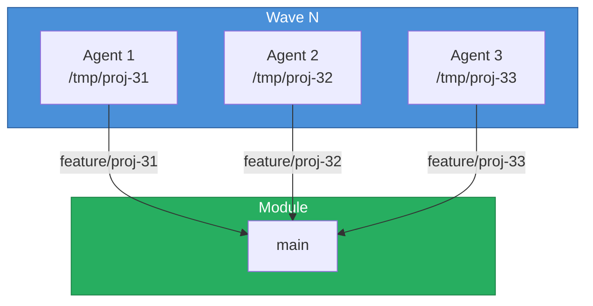

# Agent Projects

> [!abstract] Task & Project Tracking
> The projects directory manages **active work**, **task tracking**, **worktree state**, and **project context**. It provides the operational backbone for multi-task and multi-agent coordination.

## Directory Structure

```
projects/
  README.md              # this file -- tracking overview
  branching.md           # git branching & worktree strategy
  task-log.jsonl         # active task tracking (one JSON per line)
  worktree-state.json    # git worktree tracking
  {project-name}/        # project repo (git submodule)
    project.json         # project definition
    backlog.json         # task backlog
    sprints/             # sprint data
  {project-name}.md      # per-project context notes (optional)
```

## Project Repositories

> [!note] Submodule Pattern
> Each project tracked by this agent lives in its own git repository, added here as a submodule. This keeps project data (backlog, sprints, definition) versioned independently from the agent itself.

### Adding a Project

```bash
# Add a project repo as a submodule
cd agents/agent-{name}
git submodule add <project-repo-url> projects/{project-name}
git commit -m "Projects: add {project-name} as submodule"
```

### Project Submodule Structure

Each project repo should contain:

```json
// project.json
{
  "projectId": "my-project",
  "name": "My Project",
  "description": "Project description",
  "prefix": "PROJ",
  "defaultBranch": "main",
  "repo": "https://github.com/org/project-repo"
}
```

### Syncing Projects

```bash
# Pull latest project data
git submodule update --remote projects/{project-name}

# Initialize all projects after cloning the agent repo
git submodule init && git submodule update
```

### Multiple Projects

An agent can track multiple projects simultaneously. Each project is its own submodule:

```
projects/
  project-alpha/         # git submodule
  project-beta/          # git submodule
  project-alpha.md       # local context notes
  project-beta.md        # local context notes
```

### Rules

> [!warning] Source of Truth
> 1. Project repos are the source of truth for backlog, sprint data, and project definition
> 2. Agent-local context notes (`{project-name}.md`) are NOT committed to the project repo
> 3. Task-log and worktree-state track the agent's local work — NOT stored in the project repo
> 4. When cloning an agent, project submodules must be initialized separately (`git submodule init && git submodule update`)

## Task Log (`task-log.jsonl`)

One JSON object per line, per task:

```json
{
  "taskId": "PROJ-42",
  "moduleName": "my-module",
  "branchName": "feature/proj-42",
  "worktreePath": "/tmp/proj-42",
  "status": "in_progress",
  "wave": 2,
  "startedAt": "2026-04-16T10:00:00Z",
  "lastAction": "Implemented feature X",
  "blockers": [],
  "filesChanged": ["src/feature.ts"],
  "verificationGate": "pending"
}
```

### Status Values

| Status | Meaning |
|--------|---------|
| `pending` | Assigned but not started |
| `in_progress` | Actively being worked on |
| `blocked` | Cannot proceed (see `blockers` field) |
| `completed` | Done and verified |
| `failed` | Abandoned or failed verification |

### Task Log Rules

- Update on every status change
- Record `lastAction` with enough detail to resume
- List `blockers` with clear descriptions
- Track `filesChanged` for commit scoping

## Worktree State (`worktree-state.json`)

```json
{
  "worktrees": [
    {
      "taskId": "PROJ-42",
      "moduleName": "my-module",
      "worktreePath": "/tmp/proj-42",
      "branchName": "feature/proj-42",
      "baseBranch": "main",
      "status": "in_progress",
      "lastCommit": "a1b2c3d",
      "createdAt": "2026-04-16T10:00:00Z",
      "updatedAt": "2026-04-16T11:30:00Z"
    }
  ],
  "updatedAt": "2026-04-16T11:30:00Z"
}
```

## Project Context Notes

Optional per-project markdown files for persistent project knowledge:

```markdown
---
name: My Module
description: Context for ongoing work in my-module
updated: 2026-04-16
---

## Current Focus
- Feature X implementation (PROJ-42)
- Blocked on dependency upgrade (PROJ-45)

## Key Decisions
- Chose approach A over B because...
- API contract frozen until v2.0

## Team Context
- Alice owns auth module
- Deploy freeze after 2026-04-20
```

## Session Handoff

### When ending a session:
1. Update `task-log.jsonl` with final status and `lastAction`
2. Update `worktree-state.json` with current commit SHAs
3. Save non-obvious discoveries to memory (not here)

### When starting a session:
1. Read `task-log.jsonl` for in-progress or blocked work
2. Read `worktree-state.json` to verify worktrees still exist
3. Check relevant project context notes
4. `git pull --rebase` in any existing worktrees

## Wave Execution

When orchestrating multiple agents in parallel waves:



Each agent:
1. Gets assigned a task
2. Creates its own worktree
3. Works in complete isolation
4. Pushes its branch independently
5. Reports completion
6. Worktree cleaned up after merge

## See Also

- [[README|Base Profile]] -- full agent template
- [[projects/branching|Branching Strategy]] -- git workflow details
- [[memories/README|Memories]] -- persistence system
