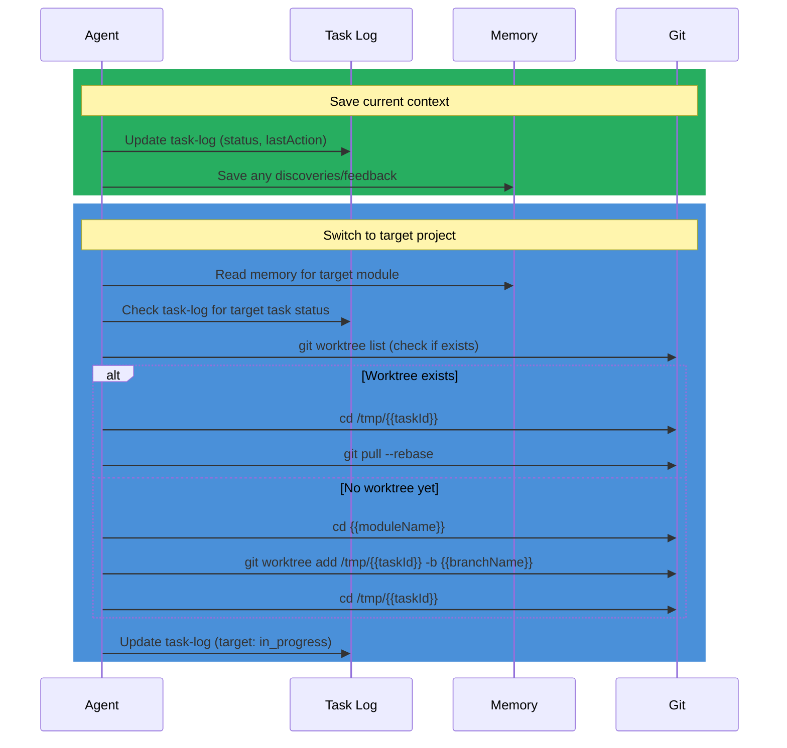
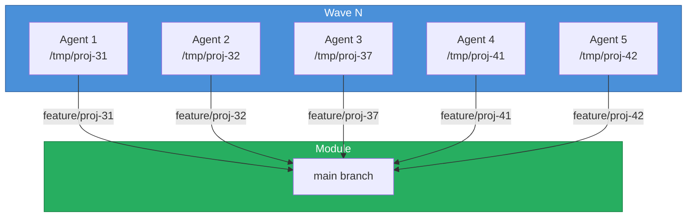
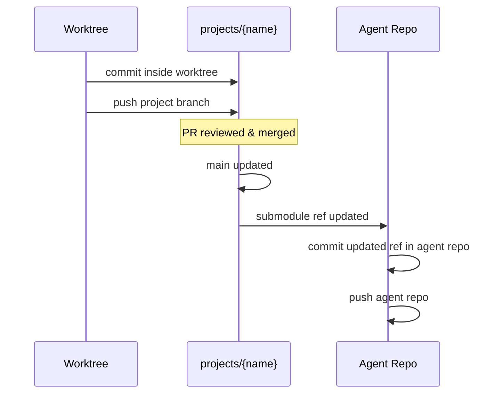

# Git Branching Strategy

> [!abstract] Worktree-Isolated Branching for Multi-Agent Coding
> Agents use **worktree isolation** as the foundation of their git workflow. Every task gets its own worktree and branch, enabling parallel work across modules without branch contamination. This strategy was born from a real incident where 5 agents in the same directory landed all changes on the wrong branch.

## Branch Naming Convention

```
feature/{{taskId}}           # New features           -> feature/proj-42
fix/{{taskId}}               # Bug fixes              -> fix/proj-99
refactor/{{taskId}}          # Refactoring            -> refactor/proj-30
chore/{{taskId}}             # Maintenance/CI         -> chore/ci-upgrade
agent/{{agentId}}/{{taskId}} # Agent-scoped work      -> agent/oracle/proj-42
release/{{version}}          # Release branches       -> release/v2026.4.16
hotfix/{{taskId}}            # Production hotfixes    -> hotfix/auth-crash
```

### Task ID Conventions

Define a prefix per module or project area. Examples:

| Prefix | Module | Example |
|--------|--------|---------|
| `{{PREFIX}}-` | `{{moduleName}}` | MOD-42 |

Each project should define its own prefix table in the agent's config or README.

---

## Worktree Isolation

### Why Worktrees?

> [!warning] Lesson Learned
> 5 agents were assigned to 5 separate features. All worked in the same directory. Result: every agent's changes ended up on a single branch instead of their own. Required manual stash-extract-sort to recover.
>
> **Root cause:** Git can only have one branch checked out per working directory. Multiple agents = multiple branches = need multiple worktrees.

### Worktree Lifecycle

```mermaid
stateDiagram-v2
    [*] --> Assign: task received

    state "Create Worktree" as Create {
        [*] --> EnterModule: cd {{moduleName}}
        EnterModule --> AddWorktree: git worktree add /tmp/{{taskId}} -b {{branchName}}
        AddWorktree --> EnterWorktree: cd /tmp/{{taskId}}
        EnterWorktree --> [*]
    }

    state "Do Work" as Work {
        [*] --> Implement
        Implement --> Test: run scoped tests
        Test --> Gate: run verification gate
        Gate --> [*]
    }

    state "Land Changes" as Land {
        [*] --> Stage: git add {{files}}
        Stage --> Commit: git commit -m "..."
        Commit --> Rebase: git pull --rebase origin main
        Rebase --> Push: git push -u origin {{branchName}}
        Push --> [*]
    }

    state "Cleanup" as Cleanup {
        [*] --> RemoveWorktree: git worktree remove /tmp/{{taskId}}
        RemoveWorktree --> DeleteBranch: git branch -d {{branchName}}
        DeleteBranch --> UpdateLog: update task-log.jsonl
        UpdateLog --> [*]
    }

    Assign --> Create
    Create --> Work
    Work --> Land
    Land --> Cleanup
    Cleanup --> [*]
```



### Command Reference

```bash
# --- CREATE -----------------------------------------------
cd {{moduleName}}                                    # enter module
git worktree add /tmp/{{taskId}} -b feature/{{taskId}} # create isolated worktree
cd /tmp/{{taskId}}                                   # enter worktree

# --- WORK -------------------------------------------------
# ... edit files ...
# run project-specific verification gate

# --- LAND -------------------------------------------------
git add src/feature.ts src/feature.test.ts
git commit -m "Auth: add token refresh handler"
git pull --rebase origin main                        # catch up with main
git push -u origin feature/{{taskId}}                # push to remote

# --- CLEANUP (after PR merge) ----------------------------
cd {{moduleName}}                                    # back to module
git worktree remove /tmp/{{taskId}}                  # remove worktree
git branch -d feature/{{taskId}}                     # delete local branch

# --- INSPECT ----------------------------------------------
git worktree list                                    # show all worktrees
git branch -a                                        # show all branches
```

---

## Project Switching

When an agent needs to move between tasks in different modules:



### Switch Checklist

1. **Save state** -- update `task-log.jsonl` with current progress and `lastAction`
2. **Save knowledge** -- persist any non-obvious discoveries to memory files
3. **Check target** -- read memory and task-log for the target project's context
4. **Enter worktree** -- `cd` to existing or create new worktree
5. **Catch up** -- `git pull --rebase` if worktree already existed
6. **Update log** -- mark new task as `in_progress`

---

## Multi-Agent Coordination

### Worktree State Tracking

`agents/agent-{{name}}/worktree-state.json` tracks all active worktrees:

```json
{
  "worktrees": [
    {
      "taskId": "PROJ-42",
      "moduleName": "my-module",
      "worktreePath": "/tmp/proj-42",
      "branchName": "feature/proj-42",
      "baseBranch": "main",
      "status": "in_progress",
      "lastCommit": "a1b2c3d",
      "lastCommitMsg": "Auth: add token refresh handler",
      "createdAt": "2026-04-16T10:00:00Z",
      "updatedAt": "2026-04-16T11:30:00Z"
    }
  ],
  "updatedAt": "2026-04-16T11:30:00Z"
}
```

### Hard Rules

| Rule | Reason | Learned From |
|------|--------|-------------|
| **One worktree per task** | Git has one branch per working directory | Multi-agent incident |
| **Never share directories** | Multiple agents = branch contamination | Multi-agent incident |
| **No `git stash`** | Cross-cutting state breaks other agents | Multi-agent safety |
| **No branch switching** | Disrupts other agents' checked-out branches | Multi-agent safety |
| **Scope commits to own files** | Unrecognized files belong to other agents | Multi-agent safety |
| **Rebase, never merge** | Linear history on `main` | Repo convention |
| **Grouped push cycles** | `commit -> pull --rebase -> push` atomically | Prevents interleaving |

### Wave Execution Pattern

When orchestrating multiple agents in waves:



Each agent in a wave:
1. Gets assigned a task from the assignment source
2. Creates its own worktree at `/tmp/{{taskId}}`
3. Works in complete isolation
4. Pushes its branch independently
5. Reports completion to the orchestrator
6. Worktree is cleaned up after merge

---

## Project Submodule Workflow

### Submodule Commit Flow

The agent repo contains project repos as git submodules under `projects/`. When work is done in a worktree, changes are committed to the project repo (the submodule). The agent repo then updates its submodule reference to point at the new commit.



```bash
# 1. Work and commit inside the project submodule worktree
cd /tmp/{{taskId}}
git add {{files}} && git commit -m "{{scope}}: {{description}}"
git push -u origin feature/{{taskId}}

# 2. After PR merge, update the agent repo's submodule ref
cd {{agentRepoRoot}}
cd projects/{{projectName}} && git pull origin main && cd ../..
git add projects/{{projectName}}
git commit -m "Update submodule ref: projects/{{projectName}} ({{taskId}})"
```

---

## See Also

- [[README|Base Profile]] -- agent base profile overview
- [[memories/memory|Memory System]] -- memory system details
